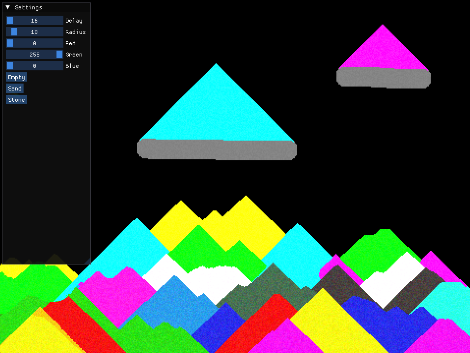

# Falling Sand



Falling Sand Simulation using SDL3 GPU with compute shaders

### Building

#### Windows

Install the [Vulkan SDK](https://www.lunarg.com/vulkan-sdk/) for glslc

```bash
git clone https://github.com/jsoulier/falling_sand --recurse-submodules
cd falling_sand
mkdir build
cd build
cmake ..
cmake --build . --parallel 8 --config Release
cd bin
./falling_sand.exe
```

#### Linux

```bash
git clone https://github.com/jsoulier/falling_sand --recurse-submodules
cd falling_sand
mkdir build
cd build
cmake .. -DCMAKE_BUILD_TYPE=Release
cmake --build . --parallel 8
cd bin
./falling_sand
```

### Algorithm

> [!NOTE]
> The algorithm is extremely inefficient. It brute-force calculates everything each frame.
> That said, I can easily get 16 million particles (4000x4000) simulating at 60 fps on my RTX 4050

1. Clear the write texture
2. Divide the area into 3x3 cells (so that there's no race conditions)
3. Dispatch 9 times (for each cell within the 3x3 cells) and simulate each particle
4. Swap the read and write texture
5. Apply a blur (not really a blur) to fill in gaps between particles

### References

- [Youtube Video](https://www.youtube.com/watch?v=5Ka3tbbT-9E&t=810s) by MARF